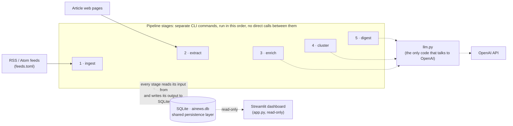

# ainews

A personal AI news aggregator. It collects AI news from RSS feeds, gets each article's text, uses an LLM to classify and summarize articles, groups articles about the same event into stories, and writes a short digest per category.

**Status:** the pipeline stages below are implemented and tested, and a read-only Streamlit dashboard displays their results.

## Architecture



- **Stages hand off only through SQLite.** Each is an independent CLI command with no in-memory hand-off, so any stage can be rerun, or run on its own schedule, without the others. There is no scheduler or orchestrator yet; you run the commands yourself.
- **Only three stages use an LLM** (`enrich`, `cluster`, `digest`). `ingest`, `extract` and `inspect-feed` are deterministic.
- **Results are versioned, not overwritten.** LLM output is keyed by model and prompt version, so a new prompt adds rows next to the old ones. A stage skips work it has already done.
- **Failures are isolated and retryable.** One failing article, story or category never stops the others, and failed work is retried on the next run, as long as it is still within the 24h window. There is no backoff, attempt limit or queue, and nothing is retried forever: once an article ages out of the window it is simply left as it is.
- **Provider isolation.** Only `ainews/llm.py` imports the OpenAI SDK (a test enforces this); the stages talk to a small `StructuredLLM` interface.
- **The dashboard is read-only by construction.** It opens SQLite through a read-only connection, and importing its code loads no pipeline or LLM module, so it cannot run a stage or call OpenAI (tests enforce both).

## Pipeline in detail

```mermaid
flowchart LR
    FT["feeds.toml<br/>sources + strategy per feed"]
    INS["inspect-feed<br/>evaluates a new source<br/>evidence only, changes nothing"]
    LLM["OpenAI<br/>(via llm.py)"]

    ING["ingest<br/>RSS → article rows<br/>24h window, URL dedup"]
    EXT["extract<br/>article → clean body<br/>fulltext or feed_content"]
    ENR["enrich<br/>body → category + summary<br/>+ English title if needed"]
    CLU["cluster<br/>non-Spam articles → stories<br/>combined summary if 2+ articles"]
    DIG["digest<br/>stories → one digest per category"]
    UI["Streamlit dashboard<br/>read-only"]

    ART1[("articles<br/>metadata · feed_text")]
    ART2[("articles<br/>+ body")]
    ENRT[("enrichments<br/>category · summary · english_title")]
    STO[("story_runs · stories<br/>story_articles link back to articles")]
    DGT[("digests<br/>headline · summary")]

    INS -.->|"you pick the strategy"| FT
    FT -.->|"strategy"| EXT
    FT --> ING --> ART1 --> EXT --> ART2 --> ENR --> ENRT --> CLU --> STO --> DIG --> DGT
    STO -.->|"read-only"| UI
    DGT -.->|"read-only"| UI
    ENR & CLU & DIG -.-> LLM
```



*Cylinders are data stored in SQLite. `articles` appears twice because it is one table shown in two states: after `ingest`, and after `extract` has filled in `body`. The other cylinders are separate tables. Each stage reads what the one before it stored and writes the next; the command table below gives the exact reads and writes.*

| Command | Reads | Does | Writes | LLM |
|---|---|---|---|---|
| `inspect-feed URL` | a feed URL and sample article pages | reports feed-wide text stats, feed text vs extracted page text (start and end), and cleanup hints; **decides nothing** | nothing (only files, if `--save-dir` is given) | no |
| `ingest` | `feeds.toml`, the feeds | keeps entries from the last 24h (UTC), dedups by URL | `articles` (metadata, `feed_text`, `body_status = pending`) | no |
| `extract` | `articles` in the 24h window without a ready body, `feeds.toml` | per feed: `fulltext` (fetch page, Trafilatura) or `feed_content` (use `feed_text`); cleans the text | `articles.body`, `body_status`, `body_error` | no |
| `enrich` | articles in the 24h window with a ready body | one call per article: category + summary + an English title when the title isn't English | `enrichments` | yes |
| `cluster` | enriched non-Spam articles from the last 24h | groups articles that describe the same event into stories; multi-article stories get a combined summary and category | `story_runs`, `stories`, `story_articles` | yes |
| `digest` | the stories of a complete story run | one call per category that has stories: a headline and a summary | `digests` | yes |
| `narrate` | today's stories (title, summary, and each source article's extracted body) per category, from the newest fully processed run | per non-Spam category with stories: one call writes a ~200-250 word spoken briefing script and persists it, a second turns that exact script into audio (`gpt-4o-mini-tts`, `alloy`); one category's failure never stops the others | `narrations` (script + run, category, model, prompt_version) and `audio/<category>.mp3` per category (overwritten) | yes |
| `streamlit run app.py` | the newest fully processed story run, its digests, and its articles' URLs | displays them; runs nothing | nothing (read-only connection) | no |

## Stage details

**ingest** (`ingest.py`). Fetches each feed, keeps entries published within 24 hours (`MAX_ARTICLE_AGE`), compared in UTC; an entry with no usable date is skipped. A feed where *no* entry has a date is "dateless" and is handled by position instead: it assumes newest-first, takes entries until the first URL already stored (only the top entry on the first run), and leaves `published_at` NULL. A URL that isn't an RSS/Atom feed is reported `FAILED` without stopping the other feeds.

**extract** (`extract.py`). The strategy is set per feed in `feeds.toml`. With `fulltext`, a failed fetch or extraction never falls back to the feed's teaser: the article simply has no body and is retried on the next run, as long as it is still within the 24h window (some sites intermittently refuse requests; a feed can set `request_delay_seconds` to pause between its page requests, which spaces requests out but doesn't change retrying). Like enrich and cluster, extract only looks at articles from the last 24h, so a persistently failing article is retried while it's recent and then simply left alone, never forever. Cleanup drops the headline if it repeats as the first paragraph and cuts the text at a per-feed `stop_markers` paragraph (a site's subscription block, say). Articles with a ready body are never fetched again.

**enrich** (`enrich.py`). Body text (capped at 24,000 characters) goes to the LLM with a strict JSON schema; the answer is `category` (one of seven, including `Spam`), `summary`, and `english_title`: an English translation of the title, or null when the title is already English (so an English title is never rewritten). The answer is validated, never repaired. The article's own `title` is never changed; the translation lives only in `enrichments`. One row per `(article, model, prompt_version)`. Only articles in the 24h window are considered, the same window cluster uses; an article that ages out is never enriched, whatever its body status. Failures store nothing.

**cluster** (`stories.py`). Input is the last 24h (`published_at`, else `fetched_at`) of articles enriched under the current model and prompt, minus Spam. One call groups them from **title and summary only** (the model isn't shown categories, and category equality isn't required); it returns only groups of two or more, so anything unmentioned is its own story and uncertainty defaults to "separate". Single-article stories copy their article's category and summary; each multi-article story gets one more call for a combined summary and category. The result is an immutable **story run**; an unchanged input finds the existing run instead of regrouping, and failed story summaries are retried without regrouping.

**digest** (`digest.py`). Works from a story run (latest, or `--run`) and **refuses to run if any story has no ready summary**. Each category with stories gets one digest made from its *stories*: a short headline (asked to be 6 to 12 words, engaging but strictly factual) and a summary, from the same call and stored together. An invalid headline fails the digest like an invalid summary, and it is retried on the next run. The model receives the category's story count, the total non-Spam count, and the other categories' counts as context, but is told to synthesize developments rather than repeat numbers; the dashboard works out the counts it shows itself, from the stories (`story_count` and `total_story_count` are stored with the digest as a record). Categories with no stories get no digest.

**dashboard** (`app.py`, `dashboard.py`). A read-only page: a header (last updated in local time, the 24h window, story and article counts) and a 2×3 grid of the six non-Spam categories. Each cell shows the category name, the headline, the digest, and a collapsed "View N stories" list of its stories (title, summary, and each source linked to its article); a category with no stories says so, and Spam is never shown. It displays the newest story run that is **fully processed**: every story summarized, and every category digested with the current digest prompt and default model, so a half-finished run, or a digest from an old experimental prompt, is never shown. Stories are newest first, with no ranking, and a story's title is its earliest article's title, in English (stories have none of their own): the translation from the enrichments the story run was built from when the title wasn't English, otherwise the article's own title. `app.py` is a thin renderer with no SQL, pipeline or OpenAI code; `dashboard.py` builds what it shows from queries in `db.py`.

**narrate** (`narrate.py`). Every non-Spam category that has stories today gets its own narration, two calls each. A category's stories go to an LLM call that writes a short spoken briefing script: each story's title, summary, and the full extracted text of its source article(s) (`articles.body`, capped per article so the request stays a sane size) - the article text is what lets the script identify things the summary alone leaves vague, like which institution or company is involved, without inventing anything the source material doesn't say. It picks 2 to 3 developments and explains them properly rather than skimming many, in a casual tone, capped at roughly 200-250 words since it is read aloud, never shown as text. The script is persisted to `narrations` (tied to the story run, category, model and prompt version, like a digest) **before** it is sent to OpenAI TTS (`gpt-4o-mini-tts`, voice `alloy`) via `llm.py`, so the exact text behind any given `audio/<category>.mp3` is always on record, even if TTS then fails. Unlike digests, there is no dedup: `narrate` is meant to be rerun for a fresh take, and always writes a fresh script (a new `narrations` row) and a fresh take of the audio, rather than being skipped because a narration already exists for that run. Each category has one fixed file, e.g. `audio/research.mp3`, `audio/product-release.mp3` (`defaults.audio_path`, a simple slug of the category name); always overwritten, and only the script is versioned, never the audio itself. A category with no stories is skipped; a failed category (either call) leaves its existing audio file untouched and never stops the others. Part of the scheduled GitHub Actions run - see Deployment below.

**inspect-feed** (`inspect_feed.py`). Onboarding aid for a new feed. It reuses the same fetching and extraction code as `extract`, so it evaluates what the pipeline would actually do, and it leaves choosing a strategy (and editing `feeds.toml`) to you.

## Data model

| Table | Holds | Key constraints |
|---|---|---|
| `articles` | feed metadata, `feed_text` (what the feed carried), `body` (text used downstream) | `url` unique; `body_status`: pending / ready / failed |
| `enrichments` | `category`, `summary`, `english_title` (NULL: already English, or enriched before this existed), `model`, `prompt_version` per article | unique `(article, model, prompt_version)` |
| `story_runs` | one clustering snapshot: models, versions, window, input fingerprint | unique on models, versions and input fingerprint |
| `stories` | a story's `category`, `summary`, `summary_status`, `grouping_reason` | belongs to a run |
| `story_articles` | which articles form each story | unique `(run, article)`: an article is in one story per run |
| `digests` | per category: `story_count`, `total_story_count`, `headline`, `summary` (`headline` is NULL on digests written before headlines existed) | unique `(run, category, model, prompt_version)` |
| `narrations` | a generated `script` per category with its `category`, `model`, `prompt_version` | belongs to a run; **no** unique constraint - see narrate below |

Foreign keys cascade on delete. The schema, migrations and every query live in `ainews/db.py`; older databases are upgraded in place on connect. SQLite runs in WAL mode, so the dashboard can read while a stage writes.

## Reruns and failure handling

| Stage | Unit of work | Skipped when | On failure |
|---|---|---|---|
| ingest | entry | URL already stored | that feed is reported `FAILED`; other feeds continue |
| extract | article | `body_status = ready`, or the article has aged out of the 24h window | recorded as `failed` with the error; retried next run while still in the window |
| enrich | article | enrichment exists for `(model, prompt_version)`, or the article has aged out of the 24h window | nothing stored; retried next run while still in the window |
| cluster | 24h snapshot | a run with the same models, versions and input exists | grouping: nothing stored; story summary: marked `failed`, retried without regrouping |
| digest | `(run, category)` | digest exists for `(model, prompt_version)` | nothing stored; retried next run |

Each LLM stage has its own model and prompt version. Changing either makes the affected work eligible again alongside the old results; nothing is deleted.

**Exit codes follow the same isolation.** An isolated item failure (a row in the "On failure" column above, or one category's narration) is reported and retried, but exits `0`: it must not stop the rest of the pipeline. Only a genuine stage failure - a config or database problem, an unexpected exception, cluster's grouping call itself failing (nothing was clustered that run), or a stage refusing to run at all (digest on an incomplete story run, narrate with no fully processed run) - exits non-zero.

## Configuration

- **`feeds.toml`**: one `[[feeds]]` table per source, with `name`, `url`, `strategy` (`feed_content` or `fulltext`, required) and optional `stop_markers` and `request_delay_seconds` (both `fulltext` only; OpenAI waits 1 second between page requests, because its pages intermittently return a Cloudflare 403). Feeds whose own text is complete, such as Simon Willison's, use `feed_content`; the rest use `fulltext`.
- **`.env`**: `OPENAI_API_KEY` (see `.env.example`). It is gitignored, and a variable in the real environment takes precedence.
- **Database backend**: local SQLite (`ainews.db`) by default. Setting `AINEWS_BACKEND=turso` in the real environment (not in `.env`, on purpose, so having the credentials in `.env` never switches your local runs to the hosted database) makes every command and the dashboard use the hosted Turso database instead, with `TURSO_DATABASE_URL` and `TURSO_AUTH_TOKEN` from the environment or `.env`. Only `db.py` knows which one is in use. On Turso the dashboard is read-only because of its token, so give it a read-only token. The two databases are independent; nothing syncs them.
- **`.streamlit/config.toml`**: dashboard settings: telemetry off, minimal toolbar, no first-run email prompt, it listens on `localhost` only, and the compact typography (base font and heading sizes) is set here rather than in CSS.
- **Defaults in code**: the 24h window (`ingest.py`); the default model `gpt-5.6-luna` (`defaults.py`, which the dashboard shares); low reasoning effort (`llm.py`); every prompt's instructions and prompt version, in one place: enrich `v4`, cluster `v1`, digest `v3` (`prompts.py`, likewise import-free and dashboard-safe). LLM stages accept `--model`; the pipeline commands accept `--db` (default `ainews.db` in the current directory), and `ingest` and `extract` accept `--feeds`.

## Running

Requires Python 3.12+.

```
pip install -e ".[dev]"
cp .env.example .env                 # then add your OpenAI API key

python -m ainews ingest
python -m ainews extract
python -m ainews enrich              # --limit N to cap a run
python -m ainews cluster
python -m ainews digest
python -m ainews narrate             # one briefing script + MP3 per category with stories, audio/<category>.mp3

streamlit run app.py                 # the read-only dashboard; run it from the project folder

python -m ainews inspect-feed <feed-url> --samples 3   # evaluate a new source
pytest                                                 # offline; uses fakes, never the real API
```

## Deployment

GitHub Actions (`.github/workflows/main.yml`) runs the whole pipeline daily against the
hosted Turso database (`AINEWS_BACKEND=turso`): ingest, extract, enrich, cluster, digest,
then narrate. The narrate step uses `continue-on-error: true`, since one category's
script or TTS failure must not stop the rest, or skip committing the categories that
*did* succeed.

The last step commits and pushes only `audio/*.mp3` (never `git add -A`) to the repo, as
the `github-actions[bot]` identity, using the workflow's own `GITHUB_TOKEN` (needs
`permissions: contents: write`, already set) - no extra secret. It's a no-op when nothing
changed (all TTS calls failed, say). Streamlit Community Cloud redeploys automatically
whenever the connected repo's default branch gets a new commit, which is a normal `git
pull` of the whole repo: the newly committed MP3s just become files in the app's
checkout, and `st.audio` (see `app.py`) reads them like any other file already in the
repo, the same way it does locally. No separate storage, no upload step, no new
Streamlit secret - the audio "deploys" simply by being committed.

One tradeoff worth knowing: this keeps every day's audio in git history forever, which
grows the repo indefinitely. Not addressed here (squashing history or moving to real
object storage both change more than this feature should).

## Layout

```
ainews/
  __main__.py     CLI
  db.py           schema, migrations, all SQL
  ingest.py       RSS -> articles
  extract.py      article bodies (fulltext / feed_content)
  enrich.py       category, summary and English title per article
  stories.py      story clustering
  digest.py       per-category digests
  llm.py          the only OpenAI code (structured JSON calls and text-to-speech)
  narrate.py      per-category stories -> briefing script -> audio/<category>.mp3
  prompts.py      every prompt's instructions and prompt version (no imports)
  inspect_feed.py onboarding tool
  dashboard.py    what the dashboard shows (no SQL, no Streamlit)
  defaults.py     default model, audio_path(category) (no imports)
app.py            Streamlit dashboard: a thin, read-only renderer
audio/            narration MP3s, one per category; committed by GitHub Actions daily
.streamlit/       dashboard settings
feeds.toml        sources and their strategies
tests/            offline tests
```


