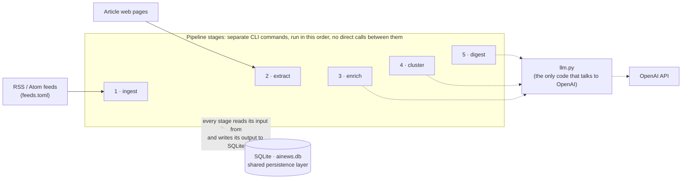

# ainews

A personal AI news aggregator, built incrementally as a learning project. It collects AI news from RSS feeds, gets each article's text, uses an LLM to classify and summarize articles, groups articles about the same event into stories, and writes a short digest per category.

**Status:** the pipeline stages below are implemented and tested. The Streamlit UI is **planned, not built**: `streamlit` is declared in `pyproject.toml`, but no UI code exists yet.

## Architecture



- **Stages hand off only through SQLite.** Each is an independent CLI command with no in-memory hand-off, so any stage can be rerun, or run on its own schedule, without the others. There is no scheduler or orchestrator yet; you run the commands yourself.
- **Only three stages use an LLM** (`enrich`, `cluster`, `digest`). `ingest`, `extract` and `inspect-feed` are deterministic.
- **Results are versioned, not overwritten.** LLM output is keyed by model and prompt version, so a new prompt adds rows next to the old ones. A stage skips work it has already done.
- **Failures are isolated and retryable.** One failing article, story or category never stops the others, and failed work is retried on the next run. There is no backoff, attempt limit or queue.
- **Provider isolation.** Only `ainews/llm.py` imports the OpenAI SDK (a test enforces this); the stages talk to a small `StructuredLLM` interface.

## Pipeline in detail

```mermaid
flowchart LR
    FT["feeds.toml<br/>sources + strategy per feed"]
    INS["inspect-feed<br/>evaluates a new source<br/>evidence only, changes nothing"]
    LLM["OpenAI<br/>(via llm.py)"]

    ING["ingest<br/>RSS → article rows<br/>24h window, URL dedup"]
    EXT["extract<br/>article → clean body<br/>fulltext or feed_content"]
    ENR["enrich<br/>body → category + summary"]
    CLU["cluster<br/>non-Spam articles → stories<br/>combined summary if 2+ articles"]
    DIG["digest<br/>stories → one digest per category"]

    ART1[("articles<br/>metadata · feed_text")]
    ART2[("articles<br/>+ body")]
    ENRT[("enrichments<br/>category · summary")]
    STO[("story_runs · stories<br/>story_articles link back to articles")]
    DGT[("digests<br/>story_count · summary")]

    INS -.->|"you pick the strategy"| FT
    FT -.->|"strategy"| EXT
    FT --> ING --> ART1 --> EXT --> ART2 --> ENR --> ENRT --> CLU --> STO --> DIG --> DGT
    ENR & CLU & DIG -.-> LLM
```



*Cylinders are data stored in SQLite. `articles` appears twice because it is one table shown in two states: after `ingest`, and after `extract` has filled in `body`. The other cylinders are separate tables. Each stage reads what the one before it stored and writes the next; the command table below gives the exact reads and writes.*

| Command | Reads | Does | Writes | LLM |
|---|---|---|---|---|
| `inspect-feed URL` | a feed URL and sample article pages | reports feed-wide text stats, feed text vs extracted page text (start and end), and cleanup hints; **decides nothing** | nothing (only files, if `--save-dir` is given) | no |
| `ingest` | `feeds.toml`, the feeds | keeps entries from the last 24h (UTC), dedups by URL | `articles` (metadata, `feed_text`, `body_status = pending`) | no |
| `extract` | `articles` without a ready body, `feeds.toml` | per feed: `fulltext` (fetch page, Trafilatura) or `feed_content` (use `feed_text`); cleans the text | `articles.body`, `body_status`, `body_error` | no |
| `enrich` | articles with a ready body | one call per article: category + summary | `enrichments` | yes |
| `cluster` | enriched non-Spam articles from the last 24h | groups articles that describe the same event into stories; multi-article stories get a combined summary and category | `story_runs`, `stories`, `story_articles` | yes |
| `digest` | the stories of a complete story run | one call per category that has stories | `digests` | yes |

## Stage details

**ingest** (`ingest.py`). Fetches each feed, keeps entries published within 24 hours (`MAX_ARTICLE_AGE`), compared in UTC; an entry with no usable date is skipped. A feed where *no* entry has a date is "dateless" and is handled by position instead: it assumes newest-first, takes entries until the first URL already stored (only the top entry on the first run), and leaves `published_at` NULL. A URL that isn't an RSS/Atom feed is reported `FAILED` without stopping the other feeds.

**extract** (`extract.py`). The strategy is set per feed in `feeds.toml`. With `fulltext`, a failed fetch or extraction never falls back to the feed's teaser: the article simply has no body and is retried on the next run (some sites intermittently refuse requests). Cleanup drops the headline if it repeats as the first paragraph and cuts the text at a per-feed `stop_markers` paragraph (a site's subscription block, say). Articles with a ready body are never fetched again.

**enrich** (`enrich.py`). Body text (capped at 24,000 characters) goes to the LLM with a strict JSON schema; the answer is `category` (one of seven, including `Spam`) and `summary`. The answer is validated, never repaired. One row per `(article, model, prompt_version)`. Failures store nothing.

**cluster** (`stories.py`). Input is the last 24h (`published_at`, else `fetched_at`) of articles enriched under the current model and prompt, minus Spam. One call groups them from **title and summary only** (the model isn't shown categories, and category equality isn't required); it returns only groups of two or more, so anything unmentioned is its own story and uncertainty defaults to "separate". Single-article stories copy their article's category and summary; each multi-article story gets one more call for a combined summary and category. The result is an immutable **story run**; an unchanged input finds the existing run instead of regrouping, and failed story summaries are retried without regrouping.

**digest** (`digest.py`). Works from a story run (latest, or `--run`) and **refuses to run if any story has no ready summary**. Each category with stories gets one digest made from its *stories*. The model receives the category's story count, the total non-Spam count, and the other categories' counts as context, but is told to synthesize developments rather than repeat numbers; a future UI is meant to show the counts, which are stored as `story_count` and `total_story_count`. Categories with no stories get no digest.

**inspect-feed** (`inspect_feed.py`). Onboarding aid for a new feed. It reuses the same fetching and extraction code as `extract`, so it evaluates what the pipeline would actually do, and it leaves choosing a strategy (and editing `feeds.toml`) to you.

## Data model

| Table | Holds | Key constraints |
|---|---|---|
| `articles` | feed metadata, `feed_text` (what the feed carried), `body` (text used downstream) | `url` unique; `body_status`: pending / ready / failed |
| `enrichments` | `category`, `summary`, `model`, `prompt_version` per article | unique `(article, model, prompt_version)` |
| `story_runs` | one clustering snapshot: models, versions, window, input fingerprint | unique on models, versions and input fingerprint |
| `stories` | a story's `category`, `summary`, `summary_status`, `grouping_reason` | belongs to a run |
| `story_articles` | which articles form each story | unique `(run, article)`: an article is in one story per run |
| `digests` | per category: `story_count`, `total_story_count`, `summary` | unique `(run, category, model, prompt_version)` |

Foreign keys cascade on delete. The schema, migrations and every query live in `ainews/db.py`; older databases are upgraded in place on connect. SQLite runs in WAL mode, so a future UI could read while a stage writes.

## Reruns and failure handling

| Stage | Unit of work | Skipped when | On failure |
|---|---|---|---|
| ingest | entry | URL already stored | that feed is reported `FAILED`; other feeds continue |
| extract | article | `body_status = ready` | recorded as `failed` with the error; retried next run |
| enrich | article | enrichment exists for `(model, prompt_version)` | nothing stored; retried next run |
| cluster | 24h snapshot | a run with the same models, versions and input exists | grouping: nothing stored; story summary: marked `failed`, retried without regrouping |
| digest | `(run, category)` | digest exists for `(model, prompt_version)` | nothing stored; retried next run |

Each LLM stage has its own model and prompt version. Changing either makes the affected work eligible again alongside the old results; nothing is deleted.

## Configuration

- **`feeds.toml`**: one `[[feeds]]` table per source, with `name`, `url`, `strategy` (`feed_content` or `fulltext`, required) and optional `stop_markers` (`fulltext` only). Six feeds use `fulltext`; Simon Willison's uses `feed_content`, because the feed already carries the whole post.
- **`.env`**: `OPENAI_API_KEY` (see `.env.example`). It is gitignored, and a variable in the real environment takes precedence.
- **Defaults in code**: the 24h window (`ingest.py`); model `gpt-5.6-luna` at low reasoning effort (`llm.py`); prompt versions: enrich `v3`, cluster `v1`, digest `v2`. LLM stages accept `--model`; the pipeline commands accept `--db` (default `ainews.db` in the current directory), and `ingest` and `extract` accept `--feeds`.

## Running

Requires Python 3.12+.

```
pip install -e ".[dev]"
cp .env.example .env                 # then add your OpenAI API key

python -m ainews ingest
python -m ainews extract
python -m ainews enrich              # --limit N to cap a run
python -m ainews cluster
python -m ainews digest

python -m ainews inspect-feed <feed-url> --samples 3   # evaluate a new source
pytest                                                 # offline; uses fakes, never the real API
```

## Layout

```
ainews/
  __main__.py     CLI
  db.py           schema, migrations, all SQL
  ingest.py       RSS -> articles
  extract.py      article bodies (fulltext / feed_content)
  enrich.py       category + summary per article
  stories.py      story clustering
  digest.py       per-category digests
  llm.py          the only OpenAI code
  inspect_feed.py onboarding tool
feeds.toml        sources and their strategies
tests/            offline tests
```

## Not built, and known limits

- **Streamlit UI**: planned; it would read the latest story run, its stories and the digests.
- **No scheduler**: stages are run by hand.
- **Prompt rules that code doesn't enforce**: summary length (at most 4 sentences) and the digest's "no historical comparison" are asked for in the prompt, and reviewed on real output rather than checked in code.
- **Failure reasons**: for enrichment, grouping and digest failures the reason appears only in that run's output. Only `extract` (`articles.body_error`) and combined story summaries (`stories.summary_error`) keep an error in the database.
- **Extraction**: a very short extraction is not treated as a failure, and one site's extraction can drop an article's first sentence.
- **Dateless feeds** rely on the feed being ordered newest-first.
- **Stories are not ranked or scored**, and clustering reads only the current enrichment version.
